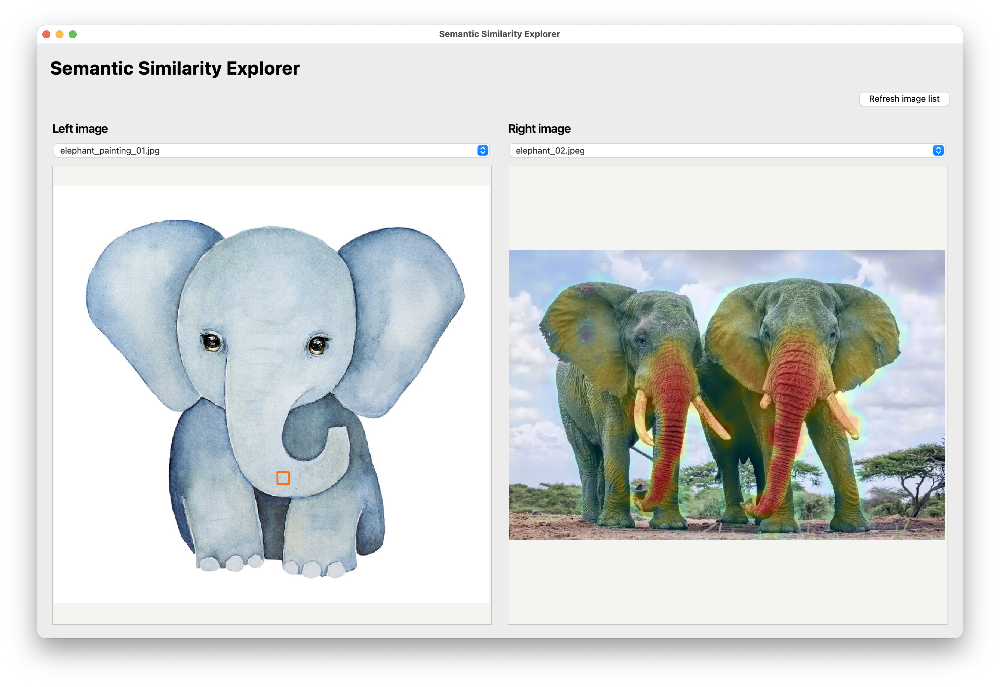

# DINO Image Similarity Explorer

This project is a local desktop app for exploring image similarity on Apple Silicon with DINOv2, Hugging Face Transformers, and a native Qt UI. It supports side-by-side image browsing, click-based patch selection, and similarity heat maps across a second image.



The repository includes demo assets in `test_images/` so the app is ready to run immediately after setup.

## What it does

- `embed`: returns one normalized embedding vector for an image
- `dense`: returns normalized per-patch features for an image, which is the building block for pixel or region similarity heat maps

## Model

This portfolio version is intentionally fixed to:

```bash
facebook/dinov2-base
```

That keeps the app behavior simple and consistent, and it gave the best results in local testing on an M1 with 16GB memory.

## Setup

This project is pinned to Python `3.12` because PyTorch support tends to lag behind the newest Python release.

Install dependencies with:

```bash
uv sync
```

Run the lightweight test suite with:

```bash
uv run python -m unittest discover -s tests
```

## Install From GitHub

Once the repository is on GitHub, you can install it directly from the repo URL:

```bash
pip install git+https://github.com/morishuz/semantic-similarity-explorer.git
```

Or with `uv`:

```bash
uv pip install git+https://github.com/morishuz/semantic-similarity-explorer.git
```

After install, you can launch the app with:

```bash
dino-ui
```

## Usage

Extract one embedding vector:

```bash
uv run python main.py embed /path/to/image.jpg
```

Extract dense patch features:

```bash
uv run python main.py dense /path/to/image.jpg
```

## UI

Put the images you want to browse into:

```bash
test_images/
```

Then launch the desktop app:

```bash
uv run python app.py
```

Or:

```bash
uv run dino-ui
```

The UI will:

- read images from `test_images`
- let you select a left and right image from dropdowns
- show the two selected images side by side
- refresh the dropdowns if you add more files while the app is open
- let you click a position on the left image and render a patch-similarity heat map over the right image
- run as a native Qt window through `PySide6`, which gives us a better path for richer click interaction, overlays, and zoom behavior

## Notes

- The script uses `mps` automatically on Apple Silicon when available, otherwise it falls back to CPU.
- The current heat map uses normalized patch-feature similarity and maps click positions by normalized image coordinates.
- If an MPS kernel is missing for a specific op, try `PYTORCH_ENABLE_MPS_FALLBACK=1`.
